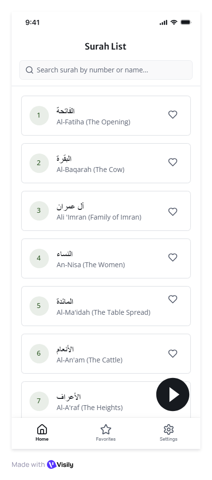
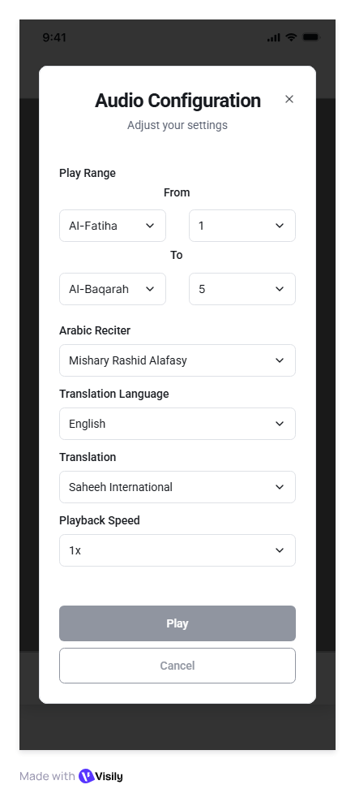

## Feature: Audio Configuration Modal

### Purpose
Let users configure playback preferences before starting the player.

---

## UI Components

### Range Picker
* Fields:  
  * **Start Ayah**  
  * **End Ayah**

### Multi-Select Dropdown
* **Surah Selection** – allows selection of one or multiple Surahs.

### Dropdowns
* **Arabic Reciter**  
  * *[Static list or API-driven – confirmation needed]*  
* **Translation Language**  
  * Options: English, Tamil, Urdu  
* **Translation Version**  
  * Dependent on selected translation language  
  * *[Confirm available versions per language]*  
* **Playback Speed**  
  * Options: 0.5x, 1x (default), 1.5x, 2x  

### Buttons
* **Play (Primary CTA)** – navigates to Media Player  
* **Cancel (Secondary CTA)** – returns to previous screen  

---

## Behavior
1. Modal pre-populates with **last-used preferences**.  
2. On save, selections are stored as defaults for future sessions.  
3. **Play** opens Media Player screen with selected settings.  
4. **Cancel** dismisses the modal.

Note: When launched from the Favorites menu, Play button should be replaced with Save button and the actions should be replaced accordingly. Refer wireframe in `04 favorites>04-favorites.md`

---

## User Flow
1. User opens Surah and is presented with the Audio Configuration Modal.  
2. User selects Surah(s), Ayah range, reciter, translation, and playback speed.  
3. User taps **Play** → Media Player opens with chosen settings.  
4. User taps **Cancel** → Modal closes and returns to previous screen.  

---

**Visual Style:**  
In sync with existing theme of the project (`lib>utils>theme.dart`).

**Wireframe:**  

*Note: Wireframes are illustrational only. Look and feel of the production app should follow the project’s theme. Clarifications can be made when required. Justifiable assumptions are fine as well.*  

    