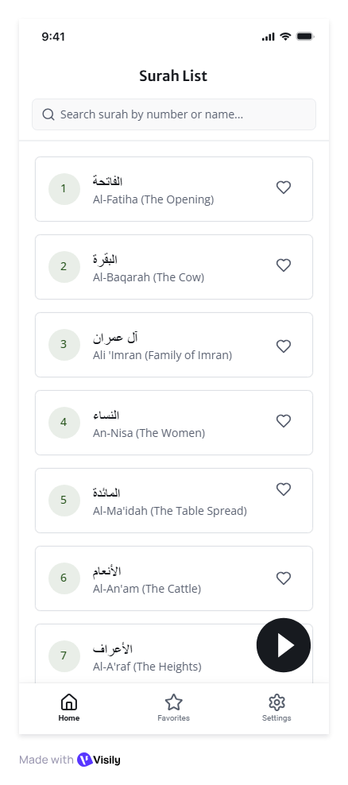
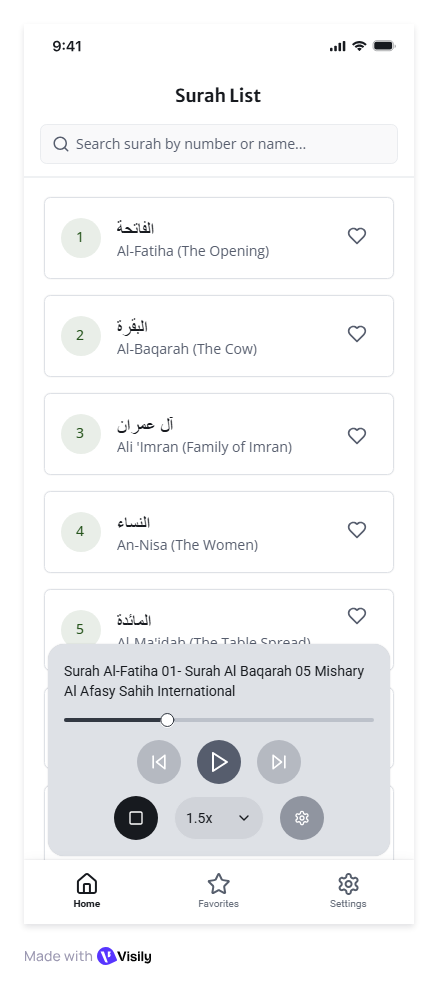

## Feature: Floating Action Button - Player

### Purpose
Provide a seamless audio playback experience optimized for Quran memorization.

---

## UI Components

### Top Bar
* **Back Navigation** – returns to Surah List screen.  
* **Title** – displays current Surah + Ayah range.  

### Player Controls
* **Play / Pause toggle**  
* **Next Verse** button  
* **Previous Verse** button  
* **Playback Speed** selector (dropdown)  
* **Stop** button

### Progress Bar
* Displays progress of current verse within the selected range.  

### Audio Streaming
* Automatic caching in the background for smooth playback.  

---

## Behavior

### Playback Speed Control

#### Available Options
* Playback speed options are hardcoded as follows: 0.5x, 0.75x, 1x, 1.25x, 1.5x, 1.75x, 2x.
* These options are presented in the playback speed selector (dropdown) in the FAB player and audio configuration modal.

#### Persistence and Application of Selected Speed
* The default playback speed can be set and saved in the Settings menu and is applied as the default for new playback sessions.
* If a user selects a different playback speed in the FAB player during a session, that selected speed is applied only for that current session. The default in Settings is not changed unless the user explicitly updates it there.

### Audio Pattern
* **Within each verse:**  
  * Arabic → 300ms pause → Translation  
* **Between verses:**  
  * Translation (previous verse) → 500ms pause → Arabic (next verse)  
* Plays **range once** (no loop).  

### Player Invocation & User Flows

#### 1. Launching from Surah Selection (User Flow 1)
* When a user clicks a Surah name in the Surah List, the FAB player is launched and audio playback starts immediately for the selected Surah/range using all default configuration options (reciter, translation, etc.).
* The range fields (From-Surah, From-Ayah, To-Surah, To-Ayah) are pre-filled based on the selected Surah.
* If any surah/range is already being played, it is terminated and the newly selected surah/range starts playing with the default config.

#### 2. Launching from FAB Button (User Flow 2)
* When a user clicks the FAB Player button (with Play icon), the Audio Configuration modal is launched.
* The range fields (From-Surah, From-Ayah, To-Surah, To-Ayah) are empty by default (no pre-filled values).
* All other options are set to their default values.
* The user can configure the required options (optional step).
* When the user clicks the Play button, the modal closes, the FAB player is launched, and audio is played according to the selected options.
* If any surah/range is already being played, it is terminated and the newly selected surah/range starts playing with the selected config.

### Stop Button Behavior
* When the user clicks the Stop button, the current audio playback session is immediately terminated. All playback is halted, and the player returns to its idle state. i.e. Surah list screen should be displayed and the FAB player icon should be displayed.

### Handling FAB Player Visibility and User Actions

#### 1. Clicking Outside the FAB Player During Playback
* If the user clicks outside the FAB player while a surah or range is being played:
  * The FAB player remains open in the background and playback continues uninterrupted.
  * The FAB player button changes to the *Pause* icon to indicate active playback.
  * If the user clicks the *Pause* button, the FAB player should be expanded for further interaction.
* The FAB player can only be closed by explicitly clicking the Stop button or using the provided close/back controls within the player interface.

#### 2. Clicking Outside the FAB Player After Pausing Playback
* If the user clicks the Pause button in the FAB player and then clicks outside the FAB player:
  * The FAB player remains open and the playback stays paused.
  * The icon should change to a third type (first-play, second-pause, third-paused) indicating there is an active (paused) session in the FAB. (A suitable standard icon can be used.)
* The user can resume playback or close the player using the Stop or back controls as usual. The paused state is visually indicated in the player.

---

## Visual Style
* Follow project theme defined in:  
  * `lib>utils>theme.dart`  

---

## Wireframe Reference
*Note: Wireframes are illustrational only. Look and feel of the production app should follow the project’s theme. Clarifications can be made when required. Justifiable assumptions are fine as well.*  

        
---

## Frequently Asked Questions (FAQ)

**Q: What happens if the user opens settings from the FAB(when a surah/range is already being played), modifies options, and clicks Play?**

A: When the user opens the settings from the FAB player, modifies playback options (such as reciter, translation, speed, or range), and clicks Play, the FAB player will immediately terminate any currently playing surah or range. Playback will then start with the newly selected options, reflecting the user's updated configuration. This ensures that the audio experience is always consistent with the most recent user preferences. i.e. Whenever the Play button is clicked, the range starts freshly from the first ayah in the selected range.

