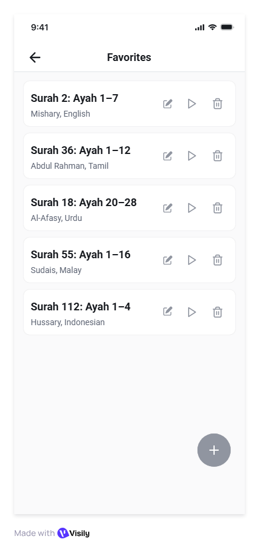
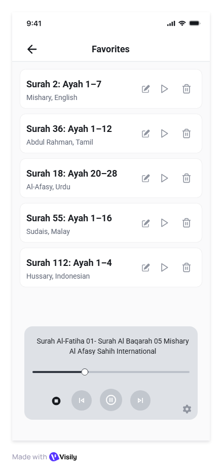
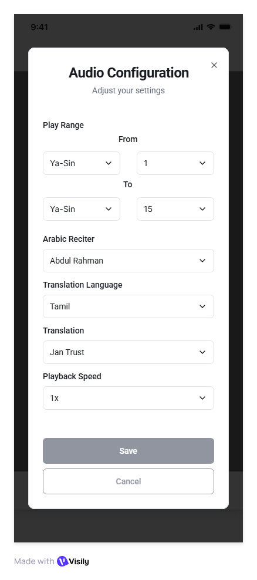

## Feature: Favorites Screen

### Purpose
Allow users quick access to saved Surah/Ayah ranges for memorization and playback.

---

## UI Components

### 1. Top Bar
* Title: **“Favorites”**
* Back navigation to previous screen

### 2. Favorites List
* Each item displays:
  * Surah number + Ayah range
  * **Play button** – opens Media Player with **default settings**
  * **Delete (trash icon)** – removes favorite after confirmation

#### Delete Confirmation Dialog
* Title: *“Delete Favorite”*
* Message: *“Are you sure you want to delete this favorite?”*
* Buttons: **Yes (Primary)** / **Cancel (Secondary)**

### 3. Floating Action Button (FAB)
* Icon: **"+"**
* Action: Opens **Range Picker Bottom Sheet** (`lib>screens>range_picker_bottom_sheet.dart`)
* Bottom sheet includes **Surah selection** and **Ayah range picker** only
* On save → new entry is added to Favorites list

---

## Example Entries
* Surah 2: Ayah 1–7
* Surah 36: Ayah 1–12

---

## Behavior
1. **Favorites List**
   * Loads persisted favorite entries on screen load
   * Displays Surah/Ayah range only
   * Each entry has Play + Delete actions

2. **Play Button** *(check player filename. required/not?)* 
   * Opens **Media Player** (`lib>screens>media_player.dart`) with **default settings**

3. **Delete Action**
   * Requires confirmation dialog before removal

4. **Add Action (FAB +)**
   * Opens **Range Picker Bottom Sheet**
   * User selects Surah and Ayah range → clicks *Save to Favorites*
   * Entry saved and shown in Favorites list
   * After save, a success message should be displayed for 3s and then the message should be closed. clicking on the message does nothing.

---

## Visual Style
* Must follow global theme defined in:
  * `lib>utils>theme.dart`
* List items styled consistently with project’s list design
* FAB styled according to existing floating action button standards

---

## Wireframe Reference
*Note: Wireframes are illustrational only. Look and feel of the production app should follow the project’s theme. Clarifications can be made when required. Justifiable assumptions are fine as well.*  

          

## Developer Notes *(check filenames. required/not?)* 
* Implement Favorites Screen in: `lib>screens>favorites.dart`
* Integrate with:
  * **Range Picker Bottom Sheet** (`lib>screens>range_picker_bottom_sheet.dart`)
  * **Media Player** (`lib>screens>media_player.dart`)
  * **Theme file** (`lib>utils>theme.dart`)
* Persistence: store favorites locally (e.g., SharedPreferences or local DB)
* Favorites only store Surah/Ayah ranges - no reciter/translation preferences

